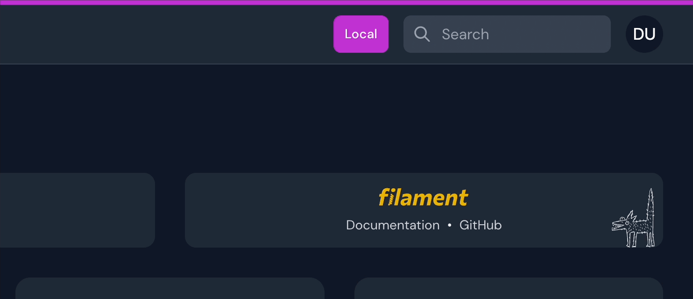

# Filament Environment Indicator

[](https://packagist.org/packages/pxlrbt/filament-environment-indicator)
[](LICENSE.md)

[](https://packagist.org/packages/pxlrbt/filament-environment-indicator)

Never confuse your tabs with different Filament environments again.



## Installation via Composer

| Plugin Version | Filament Version | PHP Version |
|----------------|------------------|-------------|
| 1.x            | ^2.9.15          | \> 8.0      |
| 2.x            | 3.x              | \> 8.1      |
| 3.x            | 4.x, 5.x         | \> 8.1      |

```bash
composer require pxlrbt/filament-environment-indicator
```

## Usage

To use this plugin register it in your panel configuration:

```php
use pxlrbt\FilamentEnvironmentIndicator\EnvironmentIndicatorPlugin;

$panel
    ->plugins([
        EnvironmentIndicatorPlugin::make(),
    ]);
```

## Configuration

Out of the box, this plugin adds a colored border to the top of the admin panel and a badge next to the search bar.

You can customize any behaviour via the plugin object.

### Customizing the view
Use `php artisan vendor:publish --tag="filament-environment-indicator-views"` to publish the view to the `resources/views/vendor/filament-environment-indicator` folder. After this you can customize it as you wish!

### Visibility

By default, the package checks whether you have Spatie permissions plugin installed and checks for a role called `super_admin`. You can further customize whether the indicators should be shown.

```php
use pxlrbt\FilamentEnvironmentIndicator\EnvironmentIndicatorPlugin;

$panel->plugins([
    EnvironmentIndicatorPlugin::make()
        ->visible(fn () => auth()->user()?->can('see_indicator'))
]);
```

### Colors

You can overwrite the default colors if you want your own colors or need to add more. The `->color()`method accepts any Filament's Color object or a closure that returns a color object.

```php
use pxlrbt\FilamentEnvironmentIndicator\EnvironmentIndicatorPlugin;
use Filament\Support\Colors\Color;

$panel->plugins([
    EnvironmentIndicatorPlugin::make()
        ->color(fn () => match (app()->environment()) {
            'production' => null,
            'staging' => Color::Orange,
            default => Color::Blue,
        })
]);
```

### Indicators

By default, both indicators are displayed on non-production environments. You can turn them off separately.

```php
use pxlrbt\FilamentEnvironmentIndicator\EnvironmentIndicatorPlugin;
use Filament\Support\Colors\Color;

$panel->plugins([
    EnvironmentIndicatorPlugin::make()
        ->showBadge(false)
        ->showBorder(true)            
]);
```

### Badge position

By default, badge position is `\Filament\View\PanelsRenderHook::GLOBAL_SEARCH_BEFORE`.

```php
use Filament\View\PanelsRenderHook;
use pxlrbt\FilamentEnvironmentIndicator\EnvironmentIndicatorPlugin;

$panel->plugins([
    EnvironmentIndicatorPlugin::make()
        ->badgePosition(PanelsRenderHook::TOPBAR_LOGO_BEFORE)
]);
```

### Git Branch

You can enable the display of the current git branch in the badge via `->showGitBranch()`. This requires the `exec()` function to be enabled in your PHP configuration.

```php
use pxlrbt\FilamentEnvironmentIndicator\EnvironmentIndicatorPlugin;
use Filament\Support\Colors\Color;

$panel->plugins([
    EnvironmentIndicatorPlugin::make()
        ->showGitBranch()                    
]);
```

### Debug Mode Warning

You can enable a debug mode warning for every environment or just for production by using `->showDebugModeWarning()`/`->showDebugModeWarningInProduction()`

```php
use pxlrbt\FilamentEnvironmentIndicator\EnvironmentIndicatorPlugin;
use Filament\Support\Colors\Color;

$panel->plugins([
    EnvironmentIndicatorPlugin::make()
        ->showDebugModeWarningInProduction()            
]);
```

## Contributing

If you want to contribute to this packages, you may want to test it in a real Filament project:

- Fork this repository to your GitHub account.
- Create a Filament app locally.
- Clone your fork in your Filament app's root directory.
- In the `/filament-environment-indicator` directory, create a branch for your fix, e.g. `fix/error-message`.

Install the packages in your app's `composer.json`:

```json
"require": {
    "pxlrbt/filament-environment-indicator": "dev-fix/error-message as main-dev",
},
"repositories": [
    {
        "type": "path",
        "url": "filament-environment-indicator"
    }
]
```

Now, run `composer update`.

## Credits
- [Dennis Koch](https://github.com/pxlrbt)
- [All Contributors](../../contributors)
